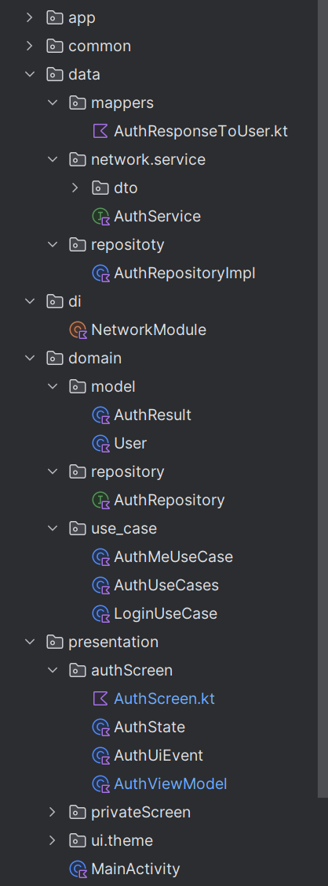
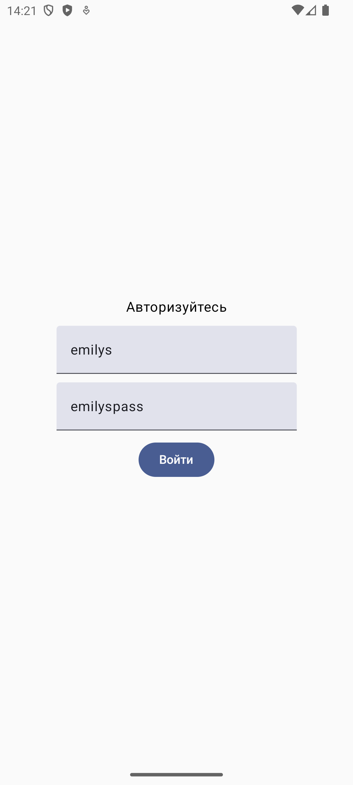
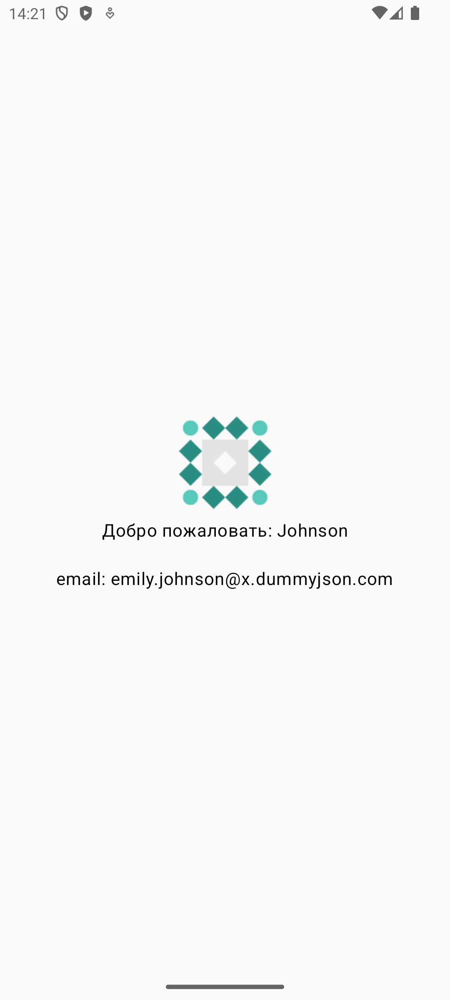

# Clean Architecture

  
   
  

## Пример чистой архитектуры в приложение

- 3 слоя data/domain/present

- useCase

- DI Hilt для внедрения зависимостей

- Mapper для данных
  
- Авторизация с сохранением токена jwt

